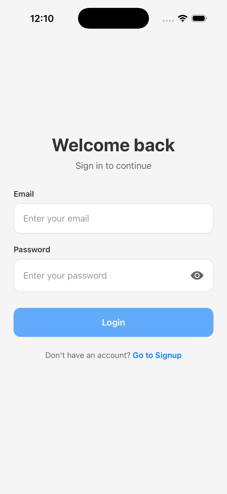
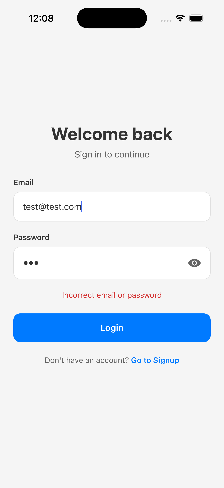
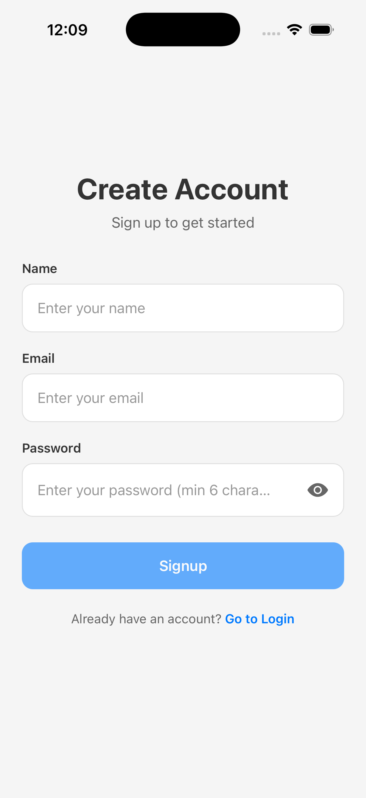
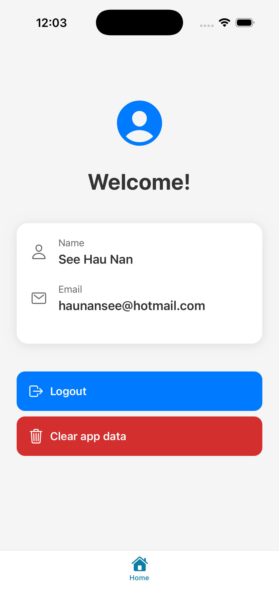

# Authentication App

A React Native mobile app with user authentication (Login and Signup) built using Expo Router and React Context API.

## What This App Does

This app allows users to:
- **Sign up** with their name, email, and password
- **Log in** with their email and password
- **View their profile** information on the home screen
- **Log out** and return to the login screen
- **Stay logged in** even after closing and reopening the app

## Screenshots

<div align="center">
  
  
  
  
</div>

## Setup Instructions

### Prerequisites

Before you begin, make sure you have the following installed:
- **Node.js** (version 18 or higher)
- **npm** or **yarn**
- **Expo CLI** (optional, but recommended)
- **Expo Go app** on your mobile device (for testing on a physical device)

### Installation Steps

1. **Clone or download this project**
   ```bash
   git clone https://github.com/haunan-see/user-auth-app.git
   cd user-auth-app
   ```

2. **Install dependencies**
   ```bash
   npm install
   ```
   This will install all required packages including:
   - React Native and Expo
   - React Navigation
   - AsyncStorage for data persistence
   - All other dependencies

3. **Start the development server**
   ```bash
   npx expo start
   ```
   This will start the Expo development server and show a QR code.

4. **Run the app on your device/emulator**

   **Option A: Using Expo Go (Physical Device)**
   - Install the Expo Go app from App Store (iOS) or Google Play (Android)
   - Scan the QR code shown in the terminal
   - The app will load on your device

   **Option B: Using iOS Simulator (Mac only)**
   - Press `i` in the terminal to open iOS Simulator
   - Make sure Xcode is installed

   **Option C: Using Android Emulator**
   - Press `a` in the terminal to open Android Emulator
   - Make sure Android Studio is installed and an emulator is set up


## How It Works

The app has three main screens:

1. **Login Screen** - Enter email and password to sign in
2. **Signup Screen** - Create a new account with name, email, and password
3. **Home Screen** - View your profile (only accessible when logged in)

**Key Components:**
- **AuthContext** - Manages authentication state across the app
- **AsyncStorage** - Saves user data locally so you stay logged in
- **Navigation** - Automatically redirects based on login status

**Flow:**
- App starts → Checks if logged in → Shows Home or Login screen
- User signs up/logs in → Data saved → Redirected to Home
- User logs out → Data cleared → Returned to Login

## Features

- Login and signup with validation
- Password visibility toggle
- Persistent login (stays logged in after app restart)
- Protected routes (home screen requires authentication)
- Form validation with error messages

## How to Use the App

Once you have the app running (see Setup Instructions above), here's how to use it:

1. **First Time?**
   - Tap "Go to Signup" on the login screen
   - Enter your name, email, and password (min 6 characters)
   - Tap "Signup"
   - You'll be automatically logged in and taken to the home screen

2. **Already Have an Account?**
   - Enter your email and password on the login screen
   - Tap "Login"
   - If credentials are correct, you'll go to the home screen

3. **Viewing Your Profile:**
   - On the home screen, you'll see your name and email
   - This information is pulled from your account

4. **Logging Out:**
   - Tap the red "Logout" button on the home screen
   - You'll be returned to the login screen
   - Your session will be cleared

## Project Structure

```
user-auth-app/   
├── app/
│   ├── _layout.tsx          # Main navigation and auth routing
│   ├── index.tsx            # Entry point (redirects based on auth)
│   ├── login.tsx            # Login screen
│   ├── signup.tsx           # Signup screen
│   └── (tabs)/
│       ├── _layout.tsx      # Tab navigation setup
│       └── index.tsx        # Home screen (protected)
├── contexts/
│   └── AuthContext.tsx      # Authentication state management
└── components/
    ├── haptic-tab.tsx       # Tab button component
    └── ui/
        └── icon-symbol.tsx  # Icon component
```

## Important Notes

This is a demo project built by **See Hau Nan**.
